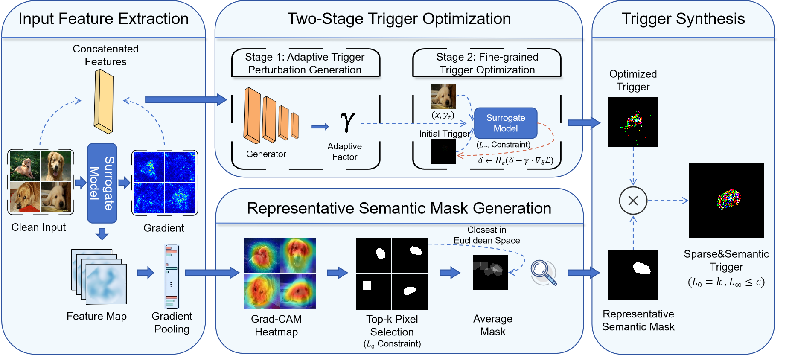

# Sparse and Invisible Backdoor Attack via Adaptive Gradient Calibration
This is the official Pytorch implementation of our paper "Sparse and Invisible Backdoor Attack via Adaptive Gradient Calibration".
<p align="center">
  
</p>

## Environment preparation
We have tested the code under the following environment settings:
- python = 3.9.21
- torch = 2.3.0
- torchvision = 0.18.0

## Launch backdoor attack
**Step1:Train surrogate model**

First, we must train a surrogate model to optimize the trigger and the generator.

```
python train_surrogate_cifar.py
```

**Step2:Train backdoor model**

Next, optimize the trigger and mask and then train the backdoor model.

```
cd backdoor
python train_backdoor.py
```
